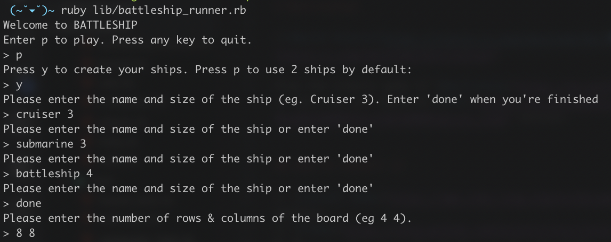
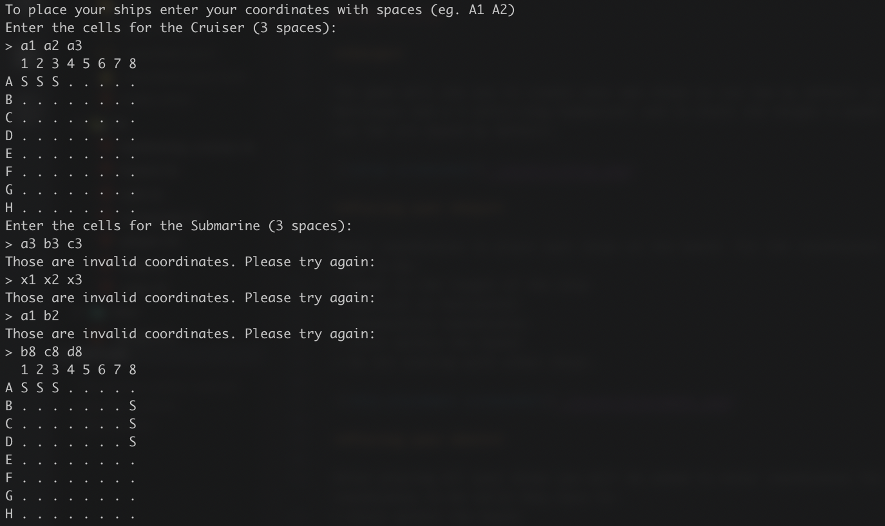
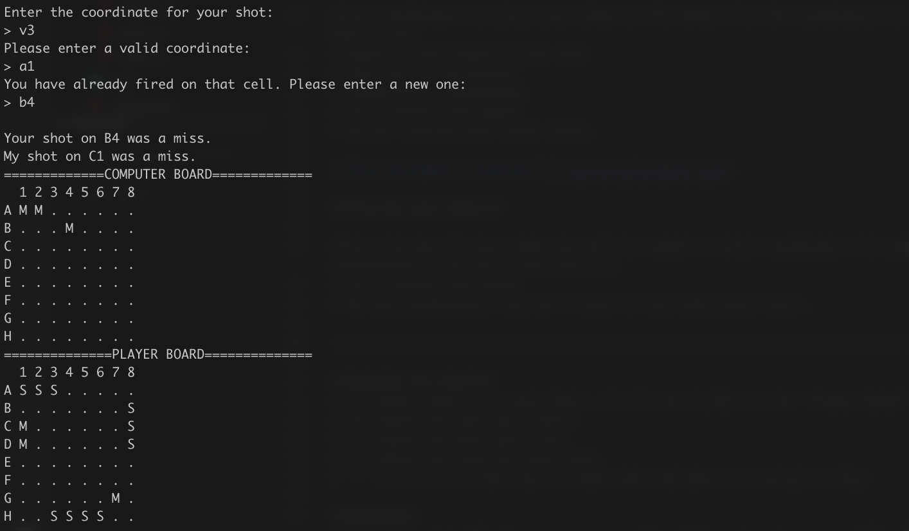

# Battleship2

[](https://travis-ci.org/nmcolome/battleship2)

Play the classic game of [Battleship](https://en.wikipedia.org/wiki/Battleship_(game)) in this new and improved [REPL](https://en.wikipedia.org/wiki/Read%E2%80%93eval%E2%80%93print_loop) version.


## How to install it

1. [Install Ruby](https://www.ruby-lang.org/en/documentation/installation/) in your machine.
2. [Clone](https://help.github.com/en/articles/cloning-a-repository) this repo 
3. Once you have your local clone, enter the following in your terminal:
```
$ cd battleship2
$ bundle install
$ ruby lib/battleship_runner.rb
```
And you're ready to play!

## How to play

**Setup**

The game will ask you to create your own ships or use two by default (a 2 units-long Destroyer and a 3 units-long Submarine) and to enter the height & width of the board or use the 4x4 board by default.



**Placing your ships**

Enter coordinates to place your ships on the board. For the coordinates to be valid they have to be:
* Equal to the length of the ship
* Vertical or horizontal
* Consecutive coordinates
* Exist within the board
* Do not overlap with other ships.



**Placing your shots**

After placing all your ships you will be asked to enter coordinates for your shot. For the coordinates to be valid they have to:
* Exist within the board
* Be new coordinates. You can't shoot in the same place twice.




**Reading the board**
* 'S' means there is a ship there. It will be visible in the 'Player Board'
* 'M' means the shot was a Miss.
* 'H' means the shot was a Hit.
* 'X' means the ship has been sunk.
* '.' it is a cell that has not been shot and does not contain a ship.

**Winning**

You have to sink all of your opponents ships before they do! Be careful! If the computer hits a ship, it will start shooting surrounding cells to try to beat you!

## Stack
This game was built with Ruby 2.4.1

## Testing
All test are done with Minitest with an 80.53% code coverage (calculated with [SimpleCov](https://github.com/colszowka/simplecov))

To run all tests, enter in your terminal:
```
$ cd battleship2
$ rake
```

To run a single test:
```
$ cd battleship2
$ ruby test/ship_test.rb
```
